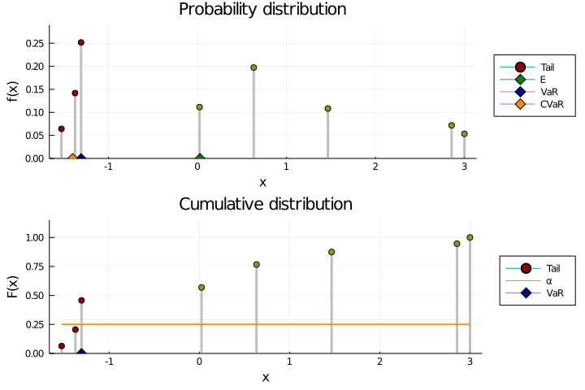

# Conditional Value-at-Risk


You can copy The Julia code from the file [`conditional-value-at-risk`](conditional-value-at-risk.jl). The example below describes the implementation and how to use it. This repository is related to my article [*Measuring Tail-Risk Using Conditional Value at Risk*](https://jaantollander.com/post/measuring-tail-risk-using-conditional-value-at-risk/), which discusses the definition, properties and implementation of conditional value at risk in more detail.

We can implement the value-at-risk and conditional value-at-risk functions in [Julia](https://julialang.org/) for discrete probability distributions as follow.

```julia
"""Value-at-risk."""
function value_at_risk(x::Vector{Float64}, f::Vector{Float64}, α::Float64)
    i = findfirst(p -> p≥α, cumsum(f))
    if i === nothing
        return x[end]
    else
        return x[i]
    end
end

"""Conditional value-at-risk."""
function conditional_value_at_risk(x::Vector{Float64}, f::Vector{Float64}, α::Float64)
    x_α = value_at_risk(x, f, α)
    if iszero(α)
        return x_α
    else
        tail = x .≤ x_α
        return (sum(x[tail] .* f[tail]) - (sum(f[tail]) - α) * x_α) / α
    end
end
```

Let us create a random discrete probability distribution.

```julia
normalize(v) = v ./ sum(v)
scale(v, low, high) = v * (high - low) + low
n = 10
x = sort(scale.(rand(n), -1.0, 1.0))
f = normalize(rand(n))
α = 0.05
```

Next, we assert that the inputs are valid. Note that the states `x` do not have to be unique for the formulation to work.

```julia
@assert issorted(x)
@assert all(f .≥ 0)
@assert sum(f) ≈ 1
@assert 0 ≤ α ≤ 1
```

Then, executing the function in Julia REPL gives us a result.

```text
julia> conditional_value_at_risk(x, f, α)
-0.9911100750623101
```
